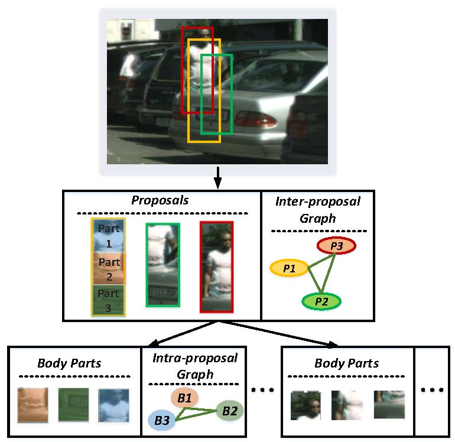

## Learning Hierarchical Graph for Occluded Pedestrian Detection
This is the official implementation of our paper "Learning Hierarchical Graph for Occluded Pedestrian Detection", https://dl.acm.org/doi/abs/10.1145/3394171.3413983, published in ACM MM 2020.

To address the occlusion issue in pedestrian detection, we propose a novel **Hierarchical Graph Pedestrian Detector (HGPD)**, which integrates semantic and spatial relation information to construct two graphs named **intra-proposal graph** and **inter-proposal graph**. With the intra-proposal graph, we can model  precise occlusion patterns and effectively suppress noisy features; with the inter-proposal graph, the weak visual cues of occluded persons can be enriched. The graph structure is shown:    



# Get Started
Please refer to [INSTALL.md](docs/INSTALL.md) for installation and dataset preparation.

Please see [GETTING_STARTED.md](docs/GETTING_STARTED.md) for the basic usage of MMDetection.
## Prepare
CityPersons data:

*  CityPersons is a popular benchmark for pedestrian detection. The dataset can be downloaded from [here](https://github.com/cvgroup-njust/CityPersons). The path of the dataset is set in configs/faster_rcnn_vgg16_1x.py. We also provide our annotation files in json format ([code:kko8](https://pan.baidu.com/s/1sE18U4uY5F4AEzxH6I884g)).

## Train
```
CUDA_VISIBLE_DEVICES=gpu_id python tools/train.py configs/faster_rcnn_vgg16_citypersons.py --work_dir xxx
```

Some errors will happen when using distributed training, we will fix this bug later.

## Test
```
CUDA_VISIBLE_DEVICES=gpu_id python tools/test.py configs/faster_rcnn_vgg16_citypersons.py path_to_your_model --eval box --out path_to_save_detection_results
```

# Models

All models are trained and evaluated on CityPersons with the input scale of 1x. To show the occlusion handling of our method, we employ different subsets of training samples, which differ in the occlusion level.  

||Reasonable|Heavy Occlusion|Model|
| ---- | ---- | ---- | ---- |
| visibility &ge; 0% | **11.51** | **41.34**  | [code:kko8](https://pan.baidu.com/s/1sE18U4uY5F4AEzxH6I884g) |
| visibility &ge; 30% | 12.24 | 42.65 |[code:kko8](https://pan.baidu.com/s/1sE18U4uY5F4AEzxH6I884g) |
| visibility &ge; 50% | 11.53 | 45.91 |[code:kko8](https://pan.baidu.com/s/1sE18U4uY5F4AEzxH6I884g) |


# Citation

If you find HGPD useful in your research, please consider citing:
```
@inproceedings{li2020learning,
  title={Learning Hierarchical Graph for Occluded Pedestrian Detection},
  author={Li, Gang and Li, Jian and Zhang, Shanshan and Yang, Jian},
  booktitle={Proceedings of the 28th ACM International Conference on Multimedia},
  pages={1597--1605},
  year={2020}
}
```

# Contacts

If you have any questions, please do not hesitate to contact gang li (李钢), gang.li@njust.edu.cn
